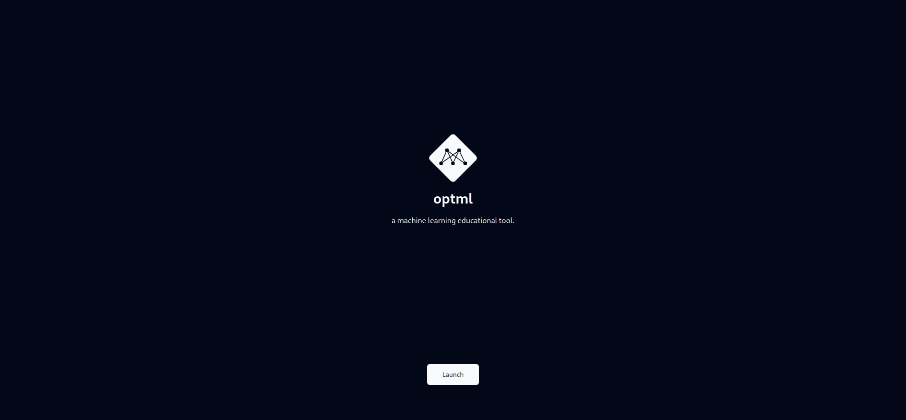
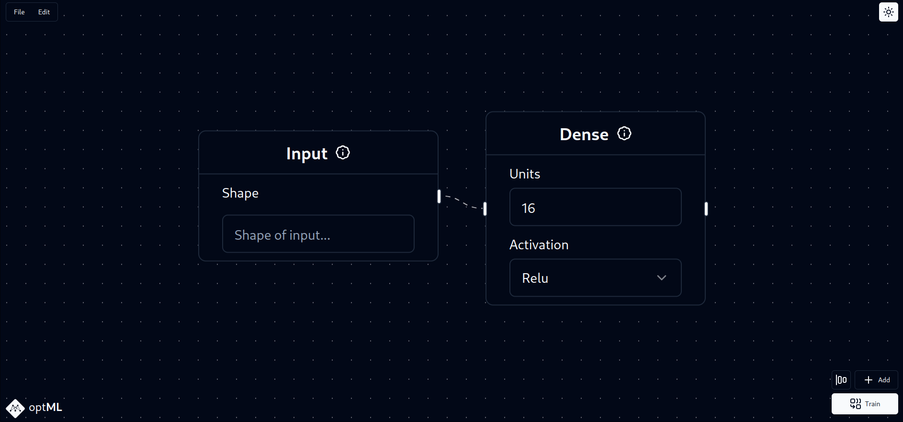
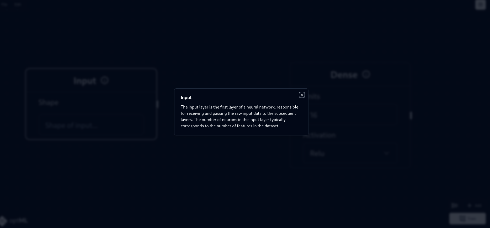
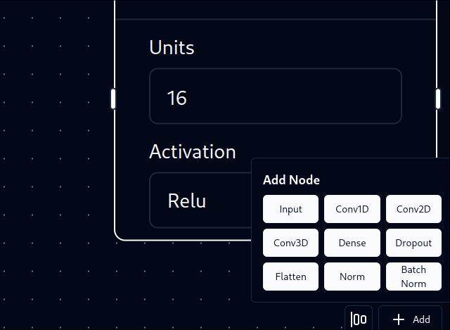
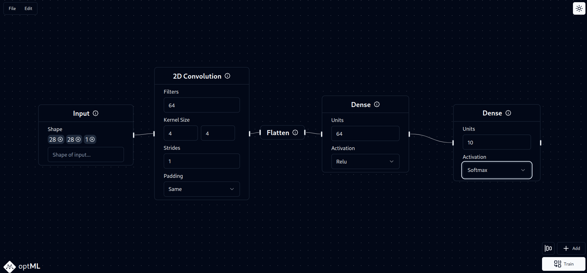
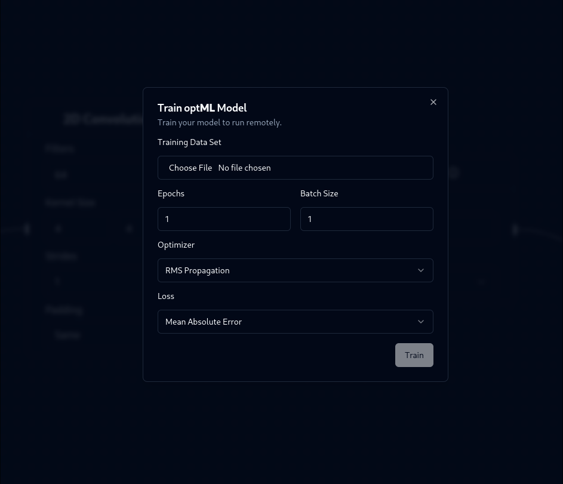

# optml
Build and tune neural network model hyperparameters in a quick codeless manner. optml is a gui editor for editing keras Sequential models and tuning hyperparameters. It has a convenient metrics graph to anaylze progress which can be used concurrently with more complete logging systems like wandb.ai.

## Usage

starting from the home screen, launch the app to begin. It may take a second to load in.

The dashboard immediately presents an input and output layer: the input layer shows the shape of the input data, excluding the batch size. For example, a model to be trained on 512x512 RGB images would use an input tensor of 512,512,3. 

**Note: numpy can be very picky with narray shapes. for example, grayscale images can take up the shape of either (X,Y) or (X,Y,1), and only the latter can be used with Conv2D layers**

Use backspace to delete any layers or edges, and drag the notches to connect layers to each other.

### Information 

Click on the white I button on certain layers or boxes to learn more about the importance and usage of different parameters and layer types. 
### Adding layers

the add button in the bottom right exposes a panel where one can drag and drop different layer types onto the board. 
The rectangular button to its left will autoformat the network graph. 

Once a graph is fully created, the train button can be used to display the hyperparameters pop up. 

## Hyperparameters

### training data
A training dataset is specified. This is a .npz file with the arrays `["trainx", "trainy", "testx", "testy"]`

### epochs
epochs are the number of times the entire datatset will be trained through: too many will result in overfitting, and too little will not result in an accurate model.

### batch size
neural networks are trained in batches at a time: the batch size is the number of data points that the network will be trained on at once. Smaller sizes are generally preferred, but it may need to be fine tuned. 32 is a good start.

### optimizer
the optimizer affects the way the model utilizes the difference between the predicted and real values. This affects how quickly and effectively the model can be trained

### loss
the loss function is how the model interprets the data it is being trained on. Crossentropy is used for classification tasks and mean error for regression tasks. 
